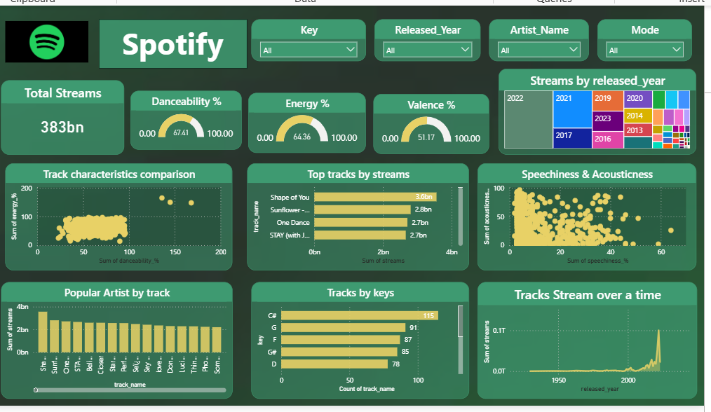

# 🎵 Spotify Streaming Analytics Dashboard

📌 Project Overview

This project presents a music streaming analytics dashboard developed to evaluate track performance, artist popularity, and audio feature characteristics using Spotify data. The dashboard applies data visualization techniques to identify streaming trends and support data-driven insights into music performance patterns.

🎯 Objectives

Analyze total streaming performance
Identify top-performing tracks and artists
Evaluate music trends across release years
Analyze audio feature characteristics (danceability, energy, valence)
Compare streaming performance across different categories
Enable interactive data exploration using filters

📊 Key Metrics

Metric	Description
Total Streams	Overall number of streams across tracks
Total Tracks	Number of songs in the dataset
Average Streams	Average streaming performance per track
Top Artists	Artists with highest streaming counts
Release Year	Distribution of songs by release year
Audio Features	Danceability, Energy, Valence, Acousticness

📈 Dashboard Features

Track performance analysis using bar charts
Artist popularity comparison
Streaming trend analysis over time
Audio feature relationship visualization (scatter plots)
Distribution analysis using treemap and charts
Interactive filtering using slicers
Multi-page dashboard navigation

🛠️ Tools and Technologies

Microsoft Power BI
Microsoft Excel / CSV dataset
DAX (Data Analysis Expressions)
Data Cleaning and Transformation
Data Visualization
Business Intelligence

🖼️ Dashboard Preview

Spotify Streaming Dashboard

📌 Business Value

Supports music performance monitoring
Helps identify popular artists and tracks
Enables trend analysis across years
Improves understanding of audio feature patterns
Supports data-driven decision-making

🚀 Future Improvements

Advanced DAX calculations (ranking, running totals)
Predictive trend forecasting
Drill-through analysis pages
Enhanced dashboard navigation and user interaction
Integration with real-time streaming data

📂 Project Structure

Spotify-Streaming-Analytics-Dashboard/
│
├── spotify_dashboard.pbix
├── spotify_dataset.csv
├── dashboard_preview.png
└── README.md

👤 Author

Hiba Fathima Y
Data Analyst / Data Science Enthusiast

